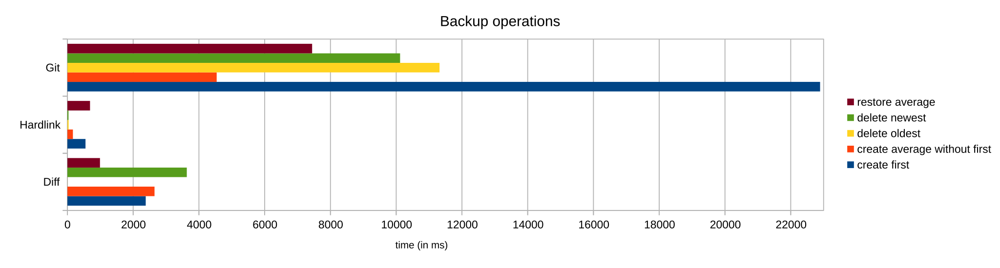
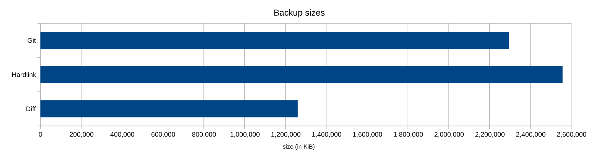

# Benchmarking MineDelta

## USE A TMPFS!

_Seriously._ This benchmarking script does a lot of IO and if you don't, you are essentially at the
mercy of you OS's caching logic to obtain reproducible results.

## Setting up a tmpfs...

**Space needed**: It depends, but roughly
`max(capture_size * number_of_captures * 0.5, capture_size * 2.5)`. If you choose too little, you'll
find out with a lot of `[Errno 28] No space left on device` errors or similar :)

**Telling `bench.py` to use your tmpfs/ramdisk:**

```shell
uv run bench.py -t /your/tmpfs [ARGS...]
```

### ... On linux

1. Check if your temporary directories is already a tmpfs. Run `df`. If the output contains a line
   like
   ```shell
   $ df
   ...
   tmpfs/none       ...             ...   ...   ...% /tmp
   ...
   ```
   you can skip this section; Some distros mount /tmp as a tmpfs out of the box.
2. Otherwise, run
   ```shell
   SIZE = "5G"  # choose an appropriate size here, see above
   TMPFS_DIR = "/mnt/tmpfs/"  # choose whatever here, but /mnt/tmpfs is a good spot
   sudo mkdir ${TMPFS_DIR}
   sudo mount -t tmpfs -o size=${SIZE} tmpfs ${TMPFS_DIR}
   ```

### ... On Windows

[TODO: TBD]

### ... On macOS

[TODO: TBD]

## Creating test data

The benchmark does not come bundled with test data as minecraft worlds cannot nicely be stored in
git: Minecraft worlds consist of many 1-10MB binary files, making them too small and numerous for
Git LFS but too large to be comfortably stored in a Repo (GitHub has a 10GiB size limit by default,
the data used to obtain the results in this file amounts to 8.6GB)

1. choose or create a minecraft world to test the performance with. The test data below used
   the [Hermitcraft Season 10 World](https://r2.hermitcraft.com/hermitcraft10.zip) with 6 captures.
2. create a capture of it:
   ```shell
    uv run bench.py capture /path/to/world
   ```
   there are many more options here (e.g. where to store captures). For more
   info, use `uv run bench.py -h` and `uv run bench.py capture -h`
3. make some changes to the world. This can be flying around, loading the nether, spawning mobs, or
   just standing afk. It does not really matter.
4. repeat step 2 and 3 until you have 3+ captures (fewer work but is not recommended)

That is all. you only need to follow these steps once, and are now ready to start benchmarking!

## Running benchmarks

There are once again many (well documented) options here:

```shell
uv run bench.py run -h
```

The key takeaway is that multiple managers for multiple operations can be combined. e.g.:

```shell
# will benchmark creating and restoring backups for Diff- and HardlinkBackupManager
# specifying -t is very recommended to reduce IO variance (see above)
# -v specifies verbosity. -vv sets the root logger to DEBUG, -v only the 'bench' logger
# no verbosity flag: loglevel INFO
# -q: loglevel WARNING
uv run bench.py -vt /mnt/tmpfs run -cr --df --hl
```

If no options after `run` are specified, all operations will be ran for all managers.

# Results

Note that these are almost impossible to reproduce. varying factors (parameters used for these
results in parentheses):

- CPU model (Ryzen 7800X3D)
- OS, even kernel version and distro (Linux Mint 22.3, 6.8.0-106-generic)
- Memory size, speed and latency (2x 16GB, 5600MT, CL 30-36-36-88)

| Raw data (in s)              |  Diff | Hardlink |    Git |
|:-----------------------------|------:|---------:|-------:|
| create first                 | 2.382 |    0.550 | 22.893 |
| create average without first | 2.649 |    0.167 |  4.540 |
| delete oldest                | 0.002 |    0.037 | 11.318 |
| delete newest                | 3.631 |    0.033 | 10.118 |
| restore average              | 0.989 |    0.688 |  7.443 |
| backup size (MiB)            | 1 231 |    2 498 |  2 241 |




As can be seen, the Diff backup manager achieves the best size reduction (as the only manager
operating on a per-chunk level) while being reasonably fast.  
If all you care about is speed, Hardlink backup manager is for you.

Git backup manager is more of a proof of concept, it is the slowest while achieving only a mediocre
size reduction. Part of the reason is that garbage collection is disabled during benchmarks. This is
because Dulwich's GC operation doesn't actually reduce the size for whatever reason, so it is
basically just a waste of time.  
Apart from that, dulwich is a git _rewrite_ in Python, so it is
naturally slower than its C counterpart. Using GitPython (a _wrapper_ arond the git binary) would
fix that, but introduce an external dependency on git
